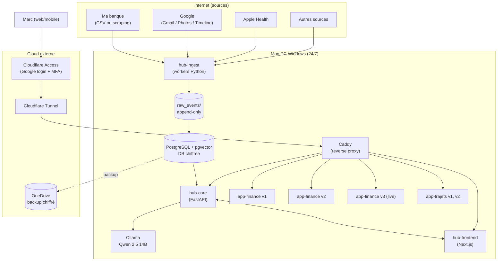
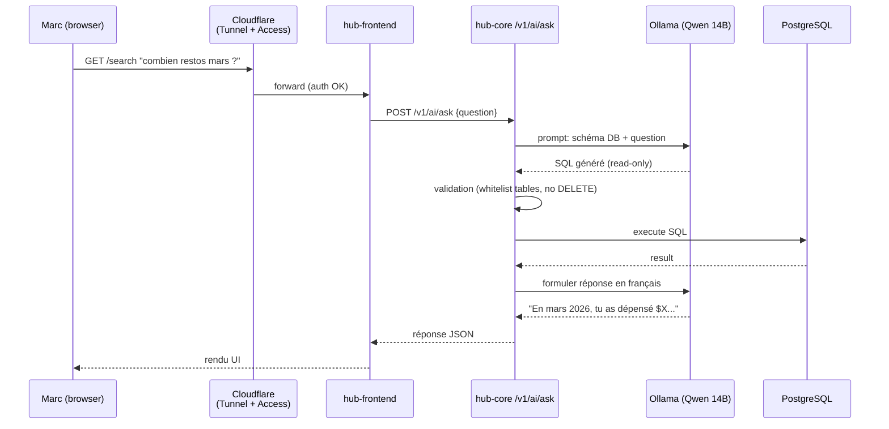
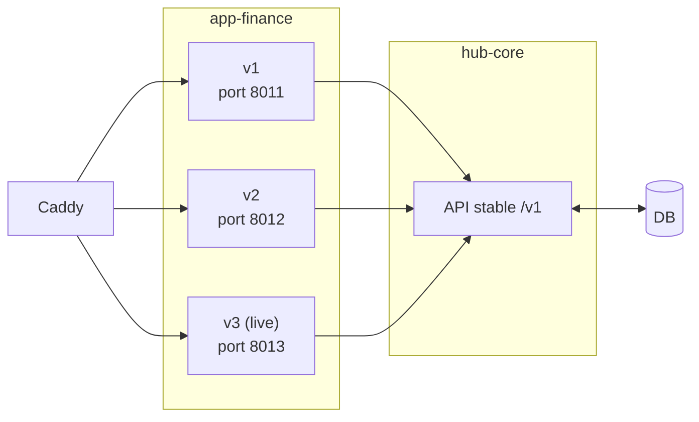

# 02 — Architecture du Personal Data Hub

## Vue d'ensemble (mermaid)

## Composants

### hub-core (Python · FastAPI)
- Sert l'API publique versionnée (`/v1/...`)
- Gère l'auth (validation JWT Cloudflare Access)
- Connexion DB
- Appelle Ollama pour les réponses IA et embeddings
- Endpoints health (`/v1/health`, `/v1/ready`)

### hub-ingest (Python · APScheduler)
- Workers cron qui rapatrient les data depuis les sources externes
- Dump en `raw_events/<source>/<date>/...` (event sourcing)
- Pipelines qui normalisent et insèrent en DB

### hub-frontend (TypeScript · Next.js)
- UI web responsive (PWA possible)
- Communique avec hub-core via API
- Embed les apps versionnées via iframes

### Apps versionnées (Python ou TS, selon ce qui existait)
- Sous-dossiers de `app-trajets/versions/v*/` etc.
- Chaque version est conteneurisée (Docker image taggée)
- Caddy route `/apps/<app>/<version>/*` vers le bon conteneur

### PostgreSQL + pgvector
- DB principale (relations, transactions, etc.)
- Vector store pour le RAG (embeddings)
- DB chiffrée at-rest (option `encryption-at-rest` Postgres ou TDE)

### Ollama (host natif, pas en Docker)
- Tourne sur le host pour profiter de la GPU NVIDIA RTX 5080
- Modèle principal : Qwen 2.5 14B Instruct (~9 GB VRAM)
- Modèle d'embeddings : nomic-embed-text

### Caddy (Docker)
- Reverse proxy
- Route les sous-chemins vers les bons services
- TLS auto (utile aussi en local pour HTTPS dev)

### Cloudflare Tunnel + Access
- Tunnel sortant : pas besoin de port ouvert chez l'ISP
- Access : auth Google + MFA avant que le hub ne soit atteint

### Backup (restic + OneDrive)
- Daily full + incrémentaux
- Chiffré client-side (key = age key)
- Restoré testé mensuellement (cron)

## Flux de data — exemple "Combien j'ai dépensé en restos en mars ?"

## Versioning des apps — comment ça marche

- Caddy route `/apps/finance/v1/*` → conteneur v1, etc.
- Toutes les versions consomment la même API stable du hub-core.
- Une seule version est "writeuse" (write-back vers DB), les autres en read-only.
- Les schémas DB évoluent → l'API masque ces changements derrière du contrat versionné.

## Décisions techniques majeures

Voir `decisions/` pour les ADRs détaillés.

- **ADR-0001** : Multi-repo
- **ADR-0002** : Event sourcing pour l'ingest
- **ADR-0003** : PostgreSQL + pgvector (vs SQLite + Chroma)
- **ADR-0004** : Ollama natif host (pas en Docker)
- **ADR-0005** : Cloudflare Tunnel + Access (vs Tailscale Funnel)
- **ADR-0006** : age + sops pour les secrets (vs Bitwarden CLI)
- **ADR-0007** : Versioning par sous-chemin Caddy (vs sous-domaines)
