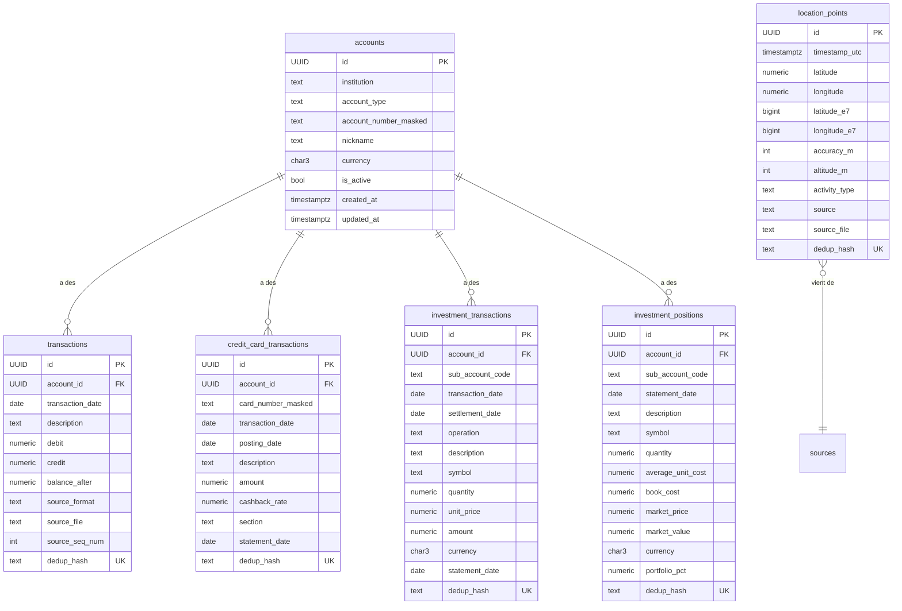

# 03 — Modèle de données

## Vue d'ensemble

À fin Phase 2, le hub a **6 tables principales** :

Le **vector store** pgvector existe en plus mais sera utilisé en Phase 3 (RAG sur emails + photos). Aucune table ne l'utilise encore.

## Conventions transversales

### Identifiants
- **PK = `UUID v4`** partout. Génération côté Python (`uuid4()`) avec fallback `gen_random_uuid()` côté Postgres si jamais.
- **FK = `UUID` + `ON DELETE CASCADE`** vers `accounts` (suppression d'un compte purge tout son historique).

### Idempotence
Toutes les tables d'événements (transactions, positions, location_points) ont un champ **`dedup_hash` `CHAR(64)` UNIQUE INDEXED**. Calculé en SHA-256 sur les champs invariants de la donnée, il garantit qu'un même événement importé 2 fois ne crée qu'1 seule ligne en DB.

Voir `decisions/0002-event-sourcing.md` pour la justification.

### Timestamps
- **`created_at` `TIMESTAMP WITH TIME ZONE`** sur chaque table, default `NOW()` côté Python (`datetime.now(UTC)`) ET côté Postgres (`server_default=func.now()`) pour les insertions hors-app.
- **`updated_at`** identique sur `accounts` (avec `onupdate`). Pas sur les tables événements (immutables par design).
- **Tout est en UTC.** Les conversions vers Europe/Paris ou America/Toronto se font à l'affichage uniquement.

### Décimaux
- **Argent : `NUMERIC(12, 2)`** (12 chiffres total, 2 décimales) pour les transactions courantes. `NUMERIC(15, 2)` pour les positions/valeurs marchandes (portefeuilles >100k$).
- **Quantités de titres : `NUMERIC(20, 6)`** (fractions de fonds, ex 0.123456 unités).
- **Coordonnées GPS : `NUMERIC(10, 7)`** = ~1cm de précision. Suffisant.
- **Cashback rate : `NUMERIC(5, 4)`** stocké en fraction (`0.0050` = 0,50 %).

### Sources et audit
Chaque table événement a 3 champs `source_*` :
- `source_format` (ex: `desjardins_csv_eop`, `desjardins_mastercard_pdf`)
- `source_file` (ex: `mars2026.csv`, `2026-01-mastercard.pdf`)
- `dedup_hash` calculé à partir des champs invariants

Permet de tracer chaque ligne en DB jusqu'à son fichier d'origine.

## Tables détaillées

### `accounts` — Comptes bancaires/financiers

| Colonne | Type | Notes |
|---|---|---|
| `id` | UUID PK | uuid4() |
| `institution` | TEXT (100) | "Desjardins" |
| `account_type` | TEXT (50) | `checking`, `savings`, `credit_card`, `investment` |
| `account_number_masked` | TEXT (100) | `377646-EOP`, `5598 22** **** 5004`, `5NFL7A3` |
| `nickname` | TEXT (100) NULL | Surnom donné par Marc |
| `currency` | CHAR(3) | `CAD` ou `USD` |
| `is_active` | BOOLEAN | False si compte fermé/archivé |
| `created_at` | TIMESTAMPTZ | |
| `updated_at` | TIMESTAMPTZ | |

**Idempotence** : `(institution, account_number_masked)` est unique métier. Pas de contrainte SQL pour rester souple, mais l'API `POST /v1/finance/accounts` retourne le compte existant si trouvé.

**Comptes attendus de Marc** (5) :
- `Desjardins / checking / 377646-EOP / CAD`
- `Desjardins / savings / 377646-ET1 / CAD`
- `Desjardins / credit_card / 5598 22** **** 5004 / CAD`
- `Desjardins / investment / 5NFL7A3 / CAD` (Disnat sous-compte CAD)
- `Desjardins / investment / 5NFL7B1 / USD` (Disnat sous-compte USD)

### `transactions` — Compte courant + épargne

| Colonne | Type | Notes |
|---|---|---|
| `id` | UUID PK | |
| `account_id` | UUID FK | CASCADE |
| `transaction_date` | DATE indexed | |
| `description` | TEXT | Libellé brut Desjardins |
| `debit` | NUMERIC(12,2) NULL | Montant sortant. NULL ssi credit non-NULL |
| `credit` | NUMERIC(12,2) NULL | Montant entrant. NULL ssi debit non-NULL |
| `balance_after` | NUMERIC(12,2) NULL | Solde après cette transaction |
| `source_format` | TEXT (50) | `desjardins_csv_eop` ou `desjardins_csv_et1` |
| `source_file` | TEXT (255) NULL | `janv2026.csv` |
| `source_seq_num` | INT NULL | Numéro de séquence Desjardins (00001-00099 dans le mois) |
| `dedup_hash` | CHAR(64) UK | SHA-256(`transit\|type\|date\|seq\|description\|debit\|credit\|balance`) |
| `created_at` | TIMESTAMPTZ | |

**Invariants** :
- ✅ `debit XOR credit` (validé Pydantic à l'API et au parser)
- ✅ `debit >= 0` ET `credit >= 0` (la signedness vient du XOR)
- ⚠️ `balance_after` peut être NULL pour les exports anciens

**Index** : `(account_id)`, `(transaction_date)`, `(dedup_hash) UNIQUE`

### `credit_card_transactions` — Mastercard

Sémantique différente des transactions bancaires : 2 dates, montant signé unique, cashback rate, carte physique distincte du compte.

| Colonne | Type | Notes |
|---|---|---|
| `id` | UUID PK | |
| `account_id` | UUID FK | Compte Mastercard administratif (`****5004`) |
| `card_number_masked` | TEXT (50) indexed | Carte physique (`****5020` chez Marc) |
| `transaction_date` | DATE indexed | Date de l'achat chez le marchand |
| `posting_date` | DATE | Date à laquelle Desjardins a inscrit la transaction |
| `description` | TEXT | Inclut ville+province collés (`PROVISION STE-ODILE QUEBEC QC`) |
| `amount` | NUMERIC(12,2) | **Signé.** `+` = achat, `-` = paiement/remboursement |
| `cashback_rate` | NUMERIC(5,4) NULL | `0.0050`, `0.0200`. NULL pour paiements/remboursements |
| `section` | TEXT (30) | `transactions_courantes` ou `operations_au_compte` |
| `source_format` | TEXT (50) | `desjardins_mastercard_pdf` |
| `source_file` | TEXT (255) NULL | `2026-01-mastercard.pdf` |
| `statement_date` | DATE NULL | Date du relevé mensuel (haut du PDF) |
| `dedup_hash` | CHAR(64) UK | Inclut `occurrence_index` pour les transactions répétées à l'identique |
| `created_at` | TIMESTAMPTZ | |

**Pourquoi `occurrence_index` dans le hash** : leçon Sprint 3. Le 26 décembre 2025, Marc avait 4 lignes identiques `MYIQ.COM/CA VANCOUVER BC 0,70` dans le PDF. Sans compteur d'occurrences, le hash collisionnait → 4 lignes du PDF → 1 seule en DB. Le compteur `#1`, `#2`, `#3`, `#4` (par tuple `(date, description, amount, section)` dans le PDF) évite ça.

**Conventions de signe** :
- Achats, frais → `amount > 0`
- Paiements (suffixe `CR` au PDF), remboursements, crédits-remises → `amount < 0`

**Index** : `(account_id)`, `(card_number_masked)`, `(transaction_date)`, `(dedup_hash) UNIQUE`

### `investment_transactions` — Disnat (CAD + USD)

Un PDF Disnat contient 2 sous-comptes (`5NFL7A3` CAD, `5NFL7B1` USD). Chacun a ses propres opérations dans la section "Activité mensuelle".

| Colonne | Type | Notes |
|---|---|---|
| `id` | UUID PK | |
| `account_id` | UUID FK | Compte parent (un Account par sous-compte) |
| `sub_account_code` | TEXT (20) NULL indexed | `5NFL7A3` ou `5NFL7B1` |
| `transaction_date` | DATE indexed | Date d'exécution de l'ordre |
| `settlement_date` | DATE NULL | Date de règlement T+2 (peut manquer) |
| `operation` | TEXT (60) | `TRANSFERT REÇU`, `ACHAT`, `VENTE`, `FRAIS`, `DIVIDENDE`, `DÉPÔT REÇU D'UNE CAISSE`, etc. |
| `description` | TEXT | Nom du titre + annotations (`TRSF IN`, `EUROCLEAR/INTL`) |
| `symbol` | TEXT (20) NULL indexed | Ticker (`NVDA`, `AVGO`, `SAF`). NULL pour transferts/frais/positions sans ticker |
| `quantity` | NUMERIC(20,6) NULL | Nombre de titres (fractions OK) |
| `unit_price` | NUMERIC(20,6) NULL | Prix unitaire si fourni |
| `amount` | NUMERIC(15,2) NULL | Montant total signé. `+` = entrée, `-` = sortie |
| `currency` | CHAR(3) NULL | Devise du montant. NULL = celle du sous-compte par défaut |
| `statement_date` | DATE indexed | Fin du mois du relevé |
| `source_format` | TEXT (50) | `desjardins_disnat_pdf` |
| `source_file` | TEXT (255) NULL | |
| `dedup_hash` | CHAR(64) UK | |
| `created_at` | TIMESTAMPTZ | |

**Stop-words tickers** : la liste `_NOT_TICKERS` du parser exclut `ETC`, `UCITS`, `SA`, `INC`, etc. qui ressemblent à des tickers mais sont des suffixes de raison sociale. Ces mots sont re-fusionnés dans la `description`. Sans cette liste, on aurait `symbol="UCITS"` au lieu de `symbol=NULL` pour `AMUNDI MSCI WORLD UCITS`.

**Index** : `(account_id)`, `(sub_account_code)`, `(transaction_date)`, `(symbol)`, `(dedup_hash) UNIQUE`

### `investment_positions` — Snapshots mensuels Disnat

Chaque ligne de la section "Détails de vos actifs" du PDF Disnat = 1 row. Un PDF de mars 2026 produit ~12-15 positions (les titres détenus à la fin du mois).

| Colonne | Type | Notes |
|---|---|---|
| `id` | UUID PK | |
| `account_id` | UUID FK | |
| `sub_account_code` | TEXT (20) indexed | Required (vs nullable sur transactions) |
| `statement_date` | DATE indexed | Fin du mois — clé temporelle de l'historique |
| `description` | TEXT | Nom du titre |
| `symbol` | TEXT (20) NULL indexed | Ticker, peut être NULL (Amundi sans symbole) |
| `quantity` | NUMERIC(20,6) | |
| `average_unit_cost` | NUMERIC(20,6) NULL | Coût moyen historique. Peut manquer si position récente |
| `book_cost` | NUMERIC(15,2) NULL | `quantity * average_unit_cost` |
| `market_price` | NUMERIC(20,6) | Prix marché unitaire au snapshot |
| `market_value` | NUMERIC(15,2) | `quantity * market_price` (devise du marché) |
| `currency` | CHAR(3) | Devise du marché (`USD`, `CAD`) |
| `portfolio_pct` | NUMERIC(5,2) NULL | % du portefeuille (donné par Disnat) |
| `source_format` | TEXT (50) | `desjardins_disnat_pdf` |
| `source_file` | TEXT (255) NULL | |
| `dedup_hash` | CHAR(64) UK | Sur `(account_id, sub_account_code, statement_date, description)` |
| `created_at` | TIMESTAMPTZ | |

**Important : `currency` ≠ devise du sous-compte.** Le sous-compte CAD `5NFL7A3` peut détenir des titres cotés en USD (ex: AMUNDI MSCI EM ASIA). La colonne `currency` ici reflète la devise du marché du titre, pas celle du compte qui le détient.

**Index** : `(account_id)`, `(sub_account_code, statement_date)` composite pour les requêtes "valeur du sous-compte au mois X", `(symbol)`, `(dedup_hash) UNIQUE`

### `location_points` — Points GPS (Google Timeline)

| Colonne | Type | Notes |
|---|---|---|
| `id` | UUID PK | |
| `timestamp_utc` | TIMESTAMPTZ indexed | Date/heure du point |
| `latitude` | NUMERIC(10,7) | Degrés décimaux ([-90, 90]) |
| `longitude` | NUMERIC(10,7) | Degrés décimaux ([-180, 180]) |
| `accuracy_m` | INT NULL | Rayon d'incertitude en mètres |
| `altitude_m` | INT NULL | Altitude (optionnel) |
| `activity_type` | TEXT (30) NULL indexed | `still`, `walking`, `cycling`, `driving` |
| `source` | TEXT (50) indexed | `google_takeout_timeline`, `manual_pin` |
| `source_file` | TEXT (255) NULL | |
| `latitude_e7` | BIGINT | Stocké entier pour idempotence stricte |
| `longitude_e7` | BIGINT | Idem |
| `dedup_hash` | CHAR(64) UK | SHA-256(`source\|timestamp_iso\|latE7\|lngE7`) |
| `created_at` | TIMESTAMPTZ | |

**Filtres appliqués au parser** (avant insertion en DB) :
- Rejet si `accuracy > 100m`
- Sample : 1 point max toutes les 30 secondes

Donc 1 jour de marche = ~120 points max au lieu de plusieurs milliers brut.

**Pas de PostGIS pour l'instant** : les requêtes bbox passent par `WHERE latitude BETWEEN ... AND ... AND longitude BETWEEN ...`. PostGIS pourrait être ajouté en Phase 5+ si on veut des requêtes "tous les points dans un rayon de 500m autour de chez moi".

**Index** : `(timestamp_utc)`, `(activity_type)`, `(source)`, `(dedup_hash) UNIQUE`

## Migrations Alembic

Toutes les migrations vivent dans `hub-core/alembic/versions/`. Convention :
- 1 migration par feature
- Nom explicite (`phase1_finance_accounts_transactions`, `phase2_location_points`)
- Toujours réversibles (`upgrade()` ET `downgrade()`)

| Migration | Phase | Tables touchées |
|---|---|---|
| `c84411d473b8_phase1_finance_accounts_transactions` | 1 | `accounts`, `transactions` |
| `cfb9d1cc7135_phase1_credit_card_transactions` | 1 | `credit_card_transactions` |
| `77b853f4a31d_phase1_investment_transactions_positions` | 1 | `investment_transactions`, `investment_positions` |
| `5044ada9f866_phase2_location_points` | 2 | `location_points` |

## Volumes attendus à 10 ans

Estimations basées sur l'usage actuel de Marc :

| Table | Volume / mois | Volume 10 ans | Taille |
|---|---|---|---|
| `transactions` | ~25 | ~3 000 | ~500 KB |
| `credit_card_transactions` | ~90 | ~10 800 | ~2 MB |
| `investment_transactions` | ~10 | ~1 200 | ~200 KB |
| `investment_positions` | ~15 (1 snapshot/mois × 15 titres) | ~1 800 | ~300 KB |
| `location_points` | ~5 000 (après sample) | ~600 000 | ~100 MB |
| **TOTAL DB hors médias** | | | **~120 MB** |

Plus tard (Phase 3+) : emails (~50k @ 5KB = 250 MB), photos métadonnées (~15k @ 1 KB = 15 MB), embeddings pgvector (~600 MB pour ~50k chunks @ 1536 dim float32). Total estimé à 10 ans avec embeddings : **~2 GB DB**, +250 GB de médias bruts hors DB.

## Évolutions prévues

- **Phase 3** : `emails` (gmail), `email_chunks` (pour pgvector RAG)
- **Phase 3** : `photos` (Google Photos via Takeout), avec embedding CLIP en pgvector
- **Phase 5** : `calendar_events`, `health_records` (Apple Health), `documents`
- **Plus tard** : tables dérivées matérialisées (`monthly_spending_by_category`, `daily_locations_summary`) si les requêtes ad-hoc deviennent trop lentes
