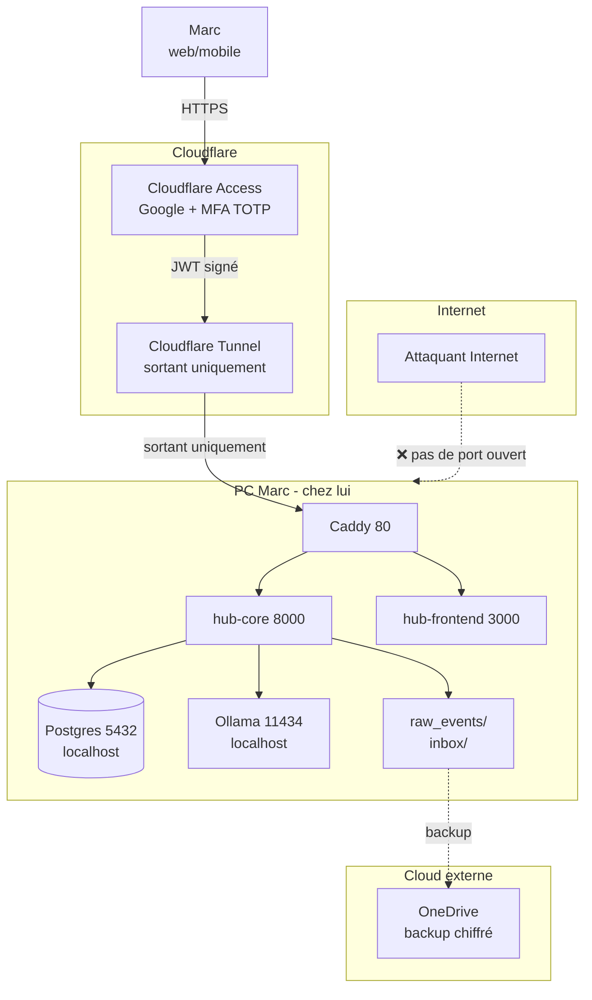

# 06 — Sécurité & threat model

## Postulat

Le hub contient **toutes les données personnelles de Marc** : transactions bancaires, salaire, valeur du portefeuille, positions, localisation 24/7, mots de passe d'accès cloud (Google), futurement emails et photos. **Pire fuite imaginable** : compromis = profil complet de Marc dans la nature.

Donc on prend la sécurité au sérieux. Pas paranoïaque, mais sérieux.

## Surface d'attaque

**Points clés** :
- Le tunnel est **sortant uniquement** : pas de port ouvert sur le routeur ISP. L'attaquant Internet ne peut pas atteindre le PC directement.
- Toute requête entrante passe par **Cloudflare Access** → Google login + MFA TOTP avant d'atteindre le backend. Sans le compte Gmail de Marc + son TOTP, **0 chance**.
- Postgres + Ollama écoutent **uniquement sur `localhost`** côté host. Les conteneurs y accèdent via le réseau Docker interne (ou `host.docker.internal` pour Ollama).

## Acteurs et menaces

### Acteur 1 : Attaquant Internet aléatoire

**Capacités** : scan de port public, brute force, exploits CVE.

**Menaces** :
1. Trouver un port exposé sur l'IP publique de Marc → exploit
2. Compromettre le DNS (DuckDNS) → MitM

**Mitigations** :
- ✅ Cloudflare Tunnel : aucun port ouvert sur le routeur ISP. Marc n'a pas besoin de port forwarding.
- ✅ Cloudflare Access devant tout : sans Google login + TOTP, 0 accès au hub.
- ✅ DuckDNS résout vers les IP de Cloudflare (pas vers chez Marc).
- ⚠️ Le tunnel Cloudflare peut tomber (panne CF). Acceptable : RTO 4-8h.

**Verdict** : risque très faible.

### Acteur 2 : Attaquant ciblé (sait que c'est Marc)

**Capacités** : phishing Marc, social engineering Cloudflare/Google support, vol physique du PC.

**Menaces** :
1. Phishing pour récupérer creds Google + intercepter TOTP → accès complet
2. Vol du PC physique → extraction de la DB
3. Vol de la sauvegarde OneDrive → décryptage du backup

**Mitigations** :
- ✅ MFA TOTP obligatoire (pas SMS-fallback)
- ⚠️ DB Postgres en clair sur le SSD. Mitigation : BitLocker activé sur le disque Windows (pré-existant chez Marc, à confirmer)
- ✅ Backup restic chiffré côté client avec clé `age` non-stockée sur OneDrive. Sans la clé, le backup OneDrive est inutilisable.
- ✅ La clé `age` est stockée sur clé USB physique chez Marc + 1 copie sur clé USB chez parents (geo-redondance).

**Verdict** : risque modéré sur le vol physique. Mitigation BitLocker est critique.

### Acteur 3 : LLM hallucine ou est manipulé

**Capacités** : générer du SQL malveillant via prompt injection.

**Menaces** :
1. Question piégée fait générer `DROP TABLE accounts; --`
2. SQL généré exfiltre des données sensibles via une condition cachée
3. SQL infini bloque la DB

**Mitigations** :
- ✅ Validation `_validate_sql()` rejette les non-SELECT et les mots-clés interdits.
- ✅ Whitelist de tables (`accounts`, `transactions`, `credit_card_transactions`, `investment_transactions`, `investment_positions`).
- ✅ `SET LOCAL statement_timeout = 5000` (5 sec max par requête).
- ✅ Le LLM tourne en local (pas d'envoi à OpenAI/Anthropic) : pas d'exfiltration externe.
- ⚠️ La validation regex est naïve : `FROM accounts -- inject` peut passer. Mitigation : on utilise SQLAlchemy `text()` pas du raw psql, donc 1 statement par requête.
- ⚠️ Pas de scoping `WHERE user_id = X` — single-user, donc pas de risque inter-tenant.

**Verdict** : risque bas tant qu'on est en mono-utilisateur. À renforcer si on ouvre à un 2ᵉ utilisateur.

### Acteur 4 : Marc lui-même

**Capacités** : faire des bêtises (rm -rf, push secret par accident, etc.).

**Menaces** :
1. `git push` du `.env` ou de fichiers `inbox/*.csv` → exposition publique
2. Suppression accidentelle de la DB
3. Modification accidentelle d'une transaction → corruption historique

**Mitigations** :
- ✅ `.gitignore` blacklist `.env`, `secrets/*.yaml` non chiffré, `inbox/`, `raw_events/`.
- ✅ Vérification manuelle pré-push : `git status -s | grep -E '\.env|inbox|raw_events|secrets/[^.]+\.yaml$'` doit être vide.
- ✅ Backup restic quotidien : `down -v` malheureux récupérable en 4-8h.
- ✅ Tables événements **immutables** par design (pas d'endpoint PATCH/DELETE).

**Verdict** : risque modéré, principalement sur le push secret. Pre-commit hook recommandé en Phase 0 fin.

### Acteur 5 : Fournisseur cloud (Google, Cloudflare, OneDrive)

**Capacités** : voir le trafic, voir les fichiers stockés, fermer le service.

**Menaces** :
1. Cloudflare déchiffre TLS → voit les requêtes API et les réponses (transactions, etc.)
2. OneDrive scanne les fichiers (Microsoft a déjà été pris à scanner des PNG illégaux)
3. Google ferme le compte Marc → perte d'auth via Cloudflare Access
4. Cloudflare ferme le tunnel free tier

**Mitigations** :
- ⚠️ **Cloudflare voit le trafic** : c'est un MitM légal. Pour les données ultra-sensibles, on pourrait forcer un mTLS mais overkill pour l'usage perso. Acceptable.
- ✅ OneDrive ne voit que le `.tar.zst` chiffré par restic — illisible sans la clé `age`. Microsoft peut scanner mais ne verra que du bruit.
- ⚠️ Si Google ferme le compte → Marc perd l'auth Cloudflare. Mitigation : ajouter un email backup (Marc a une seconde adresse perso) dans la policy Access.
- ⚠️ Cloudflare peut couper le free tier sans préavis. Mitigation : avoir un fallback Tailscale Funnel prêt (cf. ADR-0005).

**Verdict** : risque moyen long-terme. Tolérable car free et changeable.

## Gestion des secrets

### Catégories de secrets

| Secret | Sensibilité | Stockage |
|---|---|---|
| `POSTGRES_PASSWORD` | Critique (accès DB) | `.env` local + `secrets/postgres.enc.yaml` (sops) |
| `SECRET_KEY` (Pydantic) | Haute (signature future) | Idem |
| `CLOUDFLARE_TUNNEL_TOKEN` | Haute (qui contrôle le tunnel) | Idem |
| `DUCKDNS_TOKEN` | Moyenne | Idem |
| OAuth tokens Google | Critique (accès Gmail) | DB chiffré at-rest (Phase 3) |
| Clé `age` (déchiffre les backups) | **Existentielle** | Clé USB physique × 2 (jamais sur cloud) |
| Mot de passe Cloudflare Access | Délégué Google | Géré par Google |

### Vault age + sops

Voir `decisions/0006-age-sops-vs-vault.md`.

- **Génération clé** : `age-keygen -o ~/.age/hub.key`
- **Chiffrement** : `sops --encrypt --age <pubkey> secrets/postgres.yaml > secrets/postgres.enc.yaml`
- **Déchiffrement** : `SOPS_AGE_KEY_FILE=~/.age/hub.key sops --decrypt secrets/postgres.enc.yaml`

Les fichiers `secrets/*.enc.yaml` sont **commités** sur GitHub (chiffrés). Les `secrets/*.yaml` non chiffrés sont **blacklistés** dans `.gitignore`.

### Backup de la clé `age`

**Critique** : si la clé est perdue, **toutes les backups OneDrive sont perdues**.

Convention :
1. Génération initiale : `age-keygen -o ~/.age/hub.key`
2. Sauvegarde immédiate sur **2 clés USB physiques** :
   - Clé chez Marc (tiroir bureau)
   - Clé chez ses parents (geo-redondance contre incendie/inondation)
3. **JAMAIS** sur OneDrive, Google Drive, GitHub, ni un autre cloud.
4. Test de restore tous les 6 mois : `restic restore --target /tmp/test`.

## Chiffrement at-rest

### DB Postgres
- ⚠️ **Pas de chiffrement Postgres dédié.** Postgres ne supporte pas le TDE en open-source (option payante EnterpriseDB).
- ✅ **Mitigation** : BitLocker activé sur le SSD système Windows. Les fichiers Postgres sont sur ce SSD → chiffrés via BitLocker. À vérifier explicitement par Marc avec `manage-bde -status C:`.

### Fichiers raw_events / inbox
- Idem : BitLocker au niveau disque suffit.

### Backups restic
- ✅ Chiffrement client-side avant upload, clé `age`. Voir `decisions/0006-age-sops-vs-vault.md`.

## Chiffrement en transit

| Lien | Chiffré ? |
|---|---|
| Marc (browser) → Cloudflare | ✅ TLS 1.3 (Cloudflare-managed cert) |
| Cloudflare → Cloudflared (tunnel) | ✅ TLS mutuel (cert généré par Cloudflare au login) |
| Cloudflared → Caddy (host local) | ❌ HTTP en clair (réseau Docker interne) |
| Caddy → hub-core | ❌ HTTP en clair (réseau Docker interne) |
| hub-core → Postgres | ❌ Plaintext (loopback / réseau Docker interne) |
| hub-core → Ollama | ❌ Plaintext (host.docker.internal) |
| hub-ingest → hub-core | ❌ Plaintext (réseau Docker interne) |
| restic → OneDrive | ✅ TLS Microsoft + chiffrement applicatif age côté client |

Le HTTP plaintext interne est acceptable car le trafic ne quitte jamais le PC de Marc (interne Docker). Cloudflare reçoit déjà la requête déchiffrée — aucun gain à re-chiffrer en interne.

## Logs et données sensibles

### Règles
- ❌ **Ne JAMAIS logger** : passwords, tokens, OAuth refresh tokens, soldes complets, numéros de compte démasqués.
- ✅ Logger uniquement les masked : `account_number_masked` (ex: `5598 22** **** 5004`).
- ✅ Log structuré (`structlog`) avec champs typés, pas de `f"... {password} ..."`.

### Rotation
- Logs Docker : rotation Docker auto (par défaut 10 MB × 3 fichiers par container).
- Logs hub-core : stdout (capté par Docker). Pas de fichier persistent.

## Tests de sécurité prévus

### Phase 0 fin
- [ ] Test du tunnel : `curl https://marc-hub.duckdns.org/v1/health` depuis un téléphone en 4G hors WiFi maison
- [ ] Test Cloudflare Access : tentative d'accès sans login Google → doit bloquer
- [ ] Test backup/restore : `restic restore latest --target /tmp/restore-test`
- [ ] Test du `.gitignore` : `git status` après avoir mis un fichier dans `secrets/postgres.yaml` non chiffré → doit pas apparaître
- [ ] Vérification BitLocker : `manage-bde -status C:`

### Phase 1+
- [ ] Test SQL injection via `/v1/ai/ask` : poser une question piégée (`'; DROP TABLE accounts; --`) → doit renvoyer 422
- [ ] Test rate limiting Cloudflare : 1000 req/sec depuis un IP unique → doit throttle

### Périodique (mensuel/trimestriel)
- [ ] Restore test backup (mensuel)
- [ ] Vérification de la clé `age` sur les 2 clés USB (mensuel)
- [ ] Audit des deps avec `pip-audit` ou `npm audit` (trimestriel)
- [ ] Review de la liste des extensions Postgres installées

## Que faire en cas de compromis

### Compromis suspect (mais pas confirmé)
1. **Révoquer le tunnel** : `cloudflared tunnel delete marc-hub` depuis le dashboard.
2. **Bloquer Cloudflare Access** : passer la policy à "deny all" temporaire.
3. **Changer le password Google** + reset TOTP.
4. **Inspecter les logs** : `docker compose logs hub-core | grep <suspect-IP>`.

### Compromis confirmé
1. Étapes 1-3 ci-dessus.
2. **Backup d'urgence** des `raw_events/` sur clé USB.
3. **Wipe + reinstall** Windows. Pas de demi-mesure : si l'attaquant a eu un shell, considérer le PC comme grillé.
4. **Restore depuis backup restic** sur le PC propre (cf. `07-runbook.md`).
5. **Rotation de TOUS les secrets** : `POSTGRES_PASSWORD`, `SECRET_KEY`, `CLOUDFLARE_TUNNEL_TOKEN`, OAuth Google (révoquer + re-grant), `age` (générer nouvelle paire et re-chiffrer tous les backups).

### Vol du PC
1. **Cloudflare Access** : révoquer immédiatement la session Google.
2. **Tunnel** : delete le tunnel pour empêcher l'attaquant de l'utiliser.
3. Le BitLocker bloque déjà l'accès au disque sans le PIN/clé de récupération.
4. Restore sur nouveau PC (RTO 4-8h).

## Roadmap sécurité

### À faire (Phase 0 fin)
- [ ] Mise en place du tunnel Cloudflare + DuckDNS
- [ ] Mise en place Cloudflare Access avec MFA TOTP obligatoire
- [ ] Génération clé `age` + sauvegarde sur 2 clés USB
- [ ] Setup `sops` pour `secrets/*.enc.yaml`
- [ ] Pre-commit hook qui bloque les fichiers `.env`, `secrets/*.yaml` non chiffré, `inbox/`, `raw_events/`
- [ ] Vérifier BitLocker actif (`manage-bde -status C:`)
- [ ] Setup restic + premier backup réel + premier restore test

### À faire (Phase 3+ avec Gmail/Photos)
- [ ] Stockage chiffré des OAuth refresh tokens en DB (chiffrement applicatif via `cryptography.fernet`)
- [ ] Endpoint `DELETE /v1/admin/wipe?confirm=YES` qui purge tout (RGPD-style)

### À faire (long terme, optionnel)
- [ ] mTLS entre hub-core et Postgres (vs plaintext local actuel)
- [ ] Switch sur Tailscale Funnel si Cloudflare devient payant
- [ ] Hardware security module (YubiKey) pour la clé `age`
