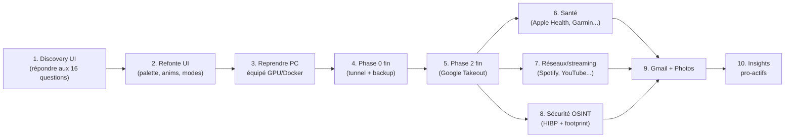

# Suite du projet — Roadmap après Session #2

> ⚠️ **Mise à jour fin Session #2 (2026-04-29)** : Marc a demandé un **redesign UI majeur** + **élargissement du scope** (santé, réseaux, sécurité OSINT). Voir [`2026-04-29_marc_redesign_request.md`](2026-04-29_marc_redesign_request.md) pour le verbatim et les questions ouvertes — **À traiter en début de Session #3**.
>
> État au 2026-04-29 : **A + C + D + E terminés** (62 fichiers, 5 repos). Tout est code-complete et documenté. La prochaine étape est de **redéployer la stack sur ton vrai PC** (équipé pour faire tourner Docker + Ollama + GPU).

## Ordre d'exécution recommandé (révisé après demande Marc 2026-04-29)



**Important** : l'ordre exact dépendra des réponses de Marc aux 16 questions du brief. Le diagramme représente une hypothèse par défaut.

## Étape 0 — Discovery UI + scope élargi 🆕 (priorité)

Marc a explicitement demandé en fin de Session #2 (2026-04-29) :
1. Refonte UI : « moins IA, plus beau, plus interactif »
2. Plus de sources de data : santé, réseaux, streaming, gaming
3. Module nouveau : **sécurité OSINT** (mes data sont-elles safe sur le web ?)

Brief complet et 16 questions ouvertes : [`2026-04-29_marc_redesign_request.md`](2026-04-29_marc_redesign_request.md)

Avant de coder quoi que ce soit, **on a besoin des réponses Marc** pour :
- Direction visuelle (palette, layout, typo, photos)
- Niveau d'interactivité acceptable (drag-drop, anims, realtime)
- Trackers santé qu'il utilise vraiment
- Plateformes streaming/social qu'il veut intégrer
- Périmètre du module sécurité (HIBP seulement ou data brokers aussi)
- Possible exception « payant » pour le module sécurité (vs règle 5)
- Priorisation des chunks
- Budget temps

## Étape 1 — Refonte UI (après discovery)

Estimé ~3 sessions. Probablement :
- Sprint A : palette + composants base + tokens (DesignSystem)
- Sprint B : pages reskinnées
- Sprint C : interactions (drag-drop, animations, realtime)

## Étape 2 — Reprendre sur le vrai PC

**Pré-requis** : un PC Windows avec :
- Docker Desktop (WSL2 backend)
- Ollama (avec GPU NVIDIA détectée)
- Node.js 20+
- Git, gh CLI
- age + sops (pour les secrets)

```powershell
# 1. Clone tous les repos
.\hub-deploy\scripts\clone_all.ps1 -TargetDir C:\hub
# (ou si déjà clonés, utilise -Pull pour update)

# 2. Setup système
cd C:\hub\hub-deploy
.\scripts\setup_windows.ps1

# 3. Bootstrap des secrets
.\scripts\init_secrets.ps1
# → génère ~/.age/hub.key, met à jour .sops.yaml

# 4. Crée les premiers secrets
$pgPwd = -join ((48..57) + (65..90) + (97..122) | Get-Random -Count 32 | ForEach-Object { [char]$_ })
$secretKey = -join ((48..57) + (65..90) + (97..122) | Get-Random -Count 32 | ForEach-Object { [char]$_ })
@"
POSTGRES_PASSWORD: $pgPwd
SECRET_KEY: $secretKey
"@ | Out-File secrets/postgres.yaml -Encoding utf8
sops --encrypt secrets/postgres.yaml > secrets/postgres.enc.yaml
Remove-Item secrets/postgres.yaml

# 5. Décrypte vers .env pour docker compose
.\scripts\decrypt_env.ps1 secrets/postgres.enc.yaml > .env

# 6. Lance la stack (mode dev)
.\scripts\start_hub.ps1

# 7. Lance les tests pour valider
cd ..\hub-core && pip install -e ".[dev]" && pytest
cd ..\hub-ingest && pip install -e ".[dev]" && pytest
cd ..\hub-frontend && npm install && npm run typecheck && npm run build
```

**Critères de succès** :
- `curl http://localhost:8000/v1/health` → `{"status":"ok"}`
- `curl http://localhost:8000/v1/ready` → tous les checks `ok`
- `pytest` passe sur hub-core et hub-ingest
- `npm run build` réussit sur hub-frontend

## Étape 3 — Phase 0 fin (déférée depuis Session #1)

### 3.a — Cloudflare Tunnel + Access

Suivre `hub-deploy/cloudflared/README.md` pas-à-pas :
1. Créer compte Cloudflare gratuit (+ ajouter domaine ; DuckDNS suffit)
2. `cloudflared tunnel login` + `cloudflared tunnel create marc-hub`
3. Configurer hostname public via dashboard Zero Trust → `marc-hub.duckdns.org` → `http://caddy:80`
4. Récupérer le `CLOUDFLARE_TUNNEL_TOKEN`, l'ajouter à `secrets/cloudflare.enc.yaml`
5. Setup Cloudflare Access policy : `marc.richard4@gmail.com` + MFA TOTP obligatoire
6. Lancer en prod : `docker compose -f docker-compose.prod.yml --env-file .env up -d --build`

**Test final** (depuis ton téléphone en 4G hors WiFi maison) :
- `https://marc-hub.duckdns.org/v1/health` → demande Google login + TOTP, puis `{"status":"ok"}`

### 3.b — Setup backup restic

Suivre `hub-deploy/backup/README.md` :
1. Installer restic + rclone
2. `rclone config` → setup OneDrive
3. Créer `secrets/restic.enc.yaml` avec mot de passe restic costaud
4. `restic init`
5. **Premier backup** : `.\backup\scripts\backup.ps1`
6. **Premier test de restore** (CRITIQUE) : `.\backup\scripts\restore.ps1 -Target C:\hub-restore-test`
7. Schedule quotidien 4am via Windows Task Scheduler

### 3.c — Sauvegarde de la clé `age` (CRITIQUE)

Voir ADR-0006 :
- Copier `~/.age/hub.key` sur **2 clés USB physiques**
- 1 chez toi (tiroir bureau)
- 1 chez tes parents (geo-redondance)
- **JAMAIS sur cloud**

Sans la clé, tous les backups OneDrive sont perdus pour de bon.

### 3.d — Vérifier BitLocker actif

```powershell
manage-bde -status C:
```

Si désactivé → activer (le DB Postgres + raw_events ne sont pas chiffrés en eux-mêmes, on compte sur le chiffrement disque).

## Étape 4 — Phase 2 fin (Google Takeout)

Code-complete depuis Session #1. Il manque juste **les données réelles** de Marc :

1. https://takeout.google.com/ → cocher uniquement « Localisation » → demander un export
2. Attendre l'email Google avec le ZIP (typiquement 1-24h)
3. Télécharger + extraire
4. Copier `Records.json` (ou `Location History.json`) dans `C:\hub\inbox\google-timeline\`
5. Lancer le pipeline :
   ```powershell
   docker compose -f docker-compose.dev.yml --profile ingest run --rm hub-ingest
   ```
6. Vérifier dans la DB :
   ```sql
   SELECT COUNT(*) FROM location_points;
   SELECT MIN(timestamp_utc), MAX(timestamp_utc) FROM location_points;
   ```
7. Tester la page `/locations` du frontend

**Volumes attendus** : ~5000 points/mois après filtres → ~600k points sur 10 ans (cf. `hub-docs/03-data-model.md`).

## Étape 5 — Santé / Réseaux / Sécurité (Marc redesign brief 2026-04-29)

Bloqués sur les réponses aux 16 questions du brief. Ordre exact à confirmer.

**Santé** (probable Apple Health export XML manuel) :
- `connectors/apple_health.py` qui parse l'export iPhone
- Modèles `health_record` + `workout`
- Page `/health` avec sparklines pas/sommeil/poids

**Streaming/social** :
- Spotify : OAuth + `/v1/me/player/recently-played` + top tracks
- YouTube : Takeout history (semantic + watch later)
- Netflix : pas d'API publique → CSV export manuel depuis le compte
- Instagram/Twitter : Takeout
- Steam : OpenID + Web API publique (gratuit)

**Sécurité OSINT** :
- HIBP API : check email + breach exposure (gratuit, K-Anonymity)
- Google search scraping : footprint web (à voir si on accepte le risque CAPTCHA)
- Inventaire de comptes : Marc renseigne manuellement, on track + relance
- Score d'exposition agrégé en dashboard

## Étape 6 — Phase 3 (Gmail + Google Photos)

Pas commencé en Session #2 (B explicitement exclue par Marc). À démarrer après Phase 0 fin + Phase 2 finalisée.

### Gmail

**Pré-requis** :
- Console Google Cloud Platform (gratuit) → créer un projet → activer Gmail API
- OAuth credentials (Desktop app) → télécharger `credentials.json`
- Stocker dans `secrets/google.enc.yaml`

**Code à écrire** (~3-4 sprints équivalents) :
- `hub-ingest/src/connectors/google_gmail.py` : OAuth2 + Gmail History API pour incrémental
- `hub-ingest/src/pipelines/gmail.py` : raw → normalisé → POST hub-core
- Modèles `Email`, `EmailAttachment` dans `hub-core/src/db/models/`
- Migration Alembic : `phase3_gmail_emails`
- Endpoints `POST/GET /v1/emails/threads`, `/messages`
- pgvector sur le contenu pour le RAG (Phase 3 fin)
- Page frontend `/emails` (recherche full-text + filters)

### Google Photos

Photos API très restreinte depuis 2025 → seul accès pratique = Takeout.

**Workflow** :
- Marc demande Takeout Photos → ZIP énorme (potentiellement 100+ GB)
- `hub-ingest/src/connectors/google_takeout_photos.py` : streame le ZIP, extrait métadonnées EXIF + filepath
- Stocke les médias bruts dans un répertoire `C:\hub\photos\` (hors DB)
- Stocke les métadonnées + thumbnails en DB
- Embedding CLIP via Ollama (`ollama pull mxbai-embed-large` ou model dédié image)
- Endpoint recherche sémantique : « photos prises à la mer cet été »

## Étape 7 — Phase 4 (Insights pro-actifs)

Endpoint `GET /v1/insights` qui détecte :
- Anomalies de dépense (Z-score sur la moyenne mobile)
- Doublons d'abonnement (Netflix prélevé 2× le même mois)
- Patterns inhabituels (saut de catégorie : « tu sors plus en avril »)
- Suggestions d'économies

Plus de la statistique que de l'IA pour ces premières détections. Le LLM est seulement pour la formulation.

## Étape 8 — Phase 5 (autres sources)

Dans l'ordre de priorité de Marc (selon JOURNAL.md) :
1. Google Calendar (API officielle, simple OAuth)
2. Apple Health (export XML manuel via iPhone → parser)
3. Documents PDFs (watcher sur `inbox/documents/`, OCR via Tesseract si scannés)

## Étape 9 — Apps embarquées versionnées

ADR-0001 + ADR-0007 prévoient `app-trajets` et `app-finance` en repos séparés avec `versions/v1/`, `v2/`, `v3/`. Marc avait des apps existantes à porter — pas démarré.

Quand on les ajoutera :
- Caddy bookings déjà en place dans `Caddyfile` (template commenté)
- Il faut créer les Dockerfiles par version
- Endpoint `/v1/admin/active-version?app=trajets` pour la version writeuse

## Tâches transverses pas démarrées

| Tâche | Phase | Fichier de référence |
|---|---|---|
| `hub-docs/08-rgpd.md` | Phase 3 | (à créer quand on aura emails/photos sensibles) |
| `hub-docs/tutorials/` | Continu | (au fil des features) |
| Endpoint `DELETE /v1/admin/wipe?confirm=YES` | Phase 3+ | RGPD-style purge |
| Tests d'intégration end-to-end | Phase 3+ | docker compose up + test scenario complet |
| Pre-commit hook bloquant `.env`, `secrets/*.yaml` non chiffré | Phase 0 fin | `.pre-commit-config.yaml` |
| Hardening : mTLS hub-core ↔ Postgres | Long terme | (overkill pour single-user) |

## Outils introduits cette session — usage

| Outil | Quand l'utiliser |
|---|---|
| `clone_all.ps1` | Bootstrap nouveau PC ou récupération après catastrophe |
| `python -m src.scripts.replay <connector>` | Quand un bug parser est découvert et qu'il faut re-traiter |
| `init_secrets.ps1` | Une fois au setup initial du vault |
| `decrypt_env.ps1` | Dans des scripts qui ont besoin de secrets en env vars |
| `backup.ps1` | Manuel ou via Task Scheduler quotidien 4am |
| `restore.ps1` | En cas de besoin (test mensuel + récupération réelle) |
| `verify.ps1` | Mensuel — vérifier l'intégrité du repo restic |

## Critères de fin de Phase 0 fin

✓ `https://marc-hub.duckdns.org/v1/health` répond depuis l'extérieur (avec auth)
✓ Backup quotidien 4am marche depuis 7 jours consécutifs
✓ Test de restore vérifié OK
✓ Clé age sauvegardée sur 2 clés USB (vérifié physiquement)
✓ BitLocker actif sur le SSD système

À ce moment-là, le hub est **prod-grade** et Marc peut commencer à charger ses vraies données depuis n'importe où dans le monde.
