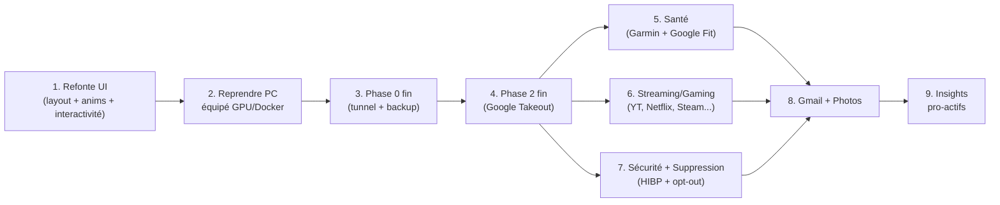

# Suite du projet — Roadmap après Session #2 + réponses discovery

> **Mise à jour 2026-04-29 (Session #3 début)** : Marc a répondu aux 16 questions de discovery.
> Les décisions sont verrouillées dans [`2026-04-29_marc_answers_discovery.md`](2026-04-29_marc_answers_discovery.md).
> On peut maintenant planifier concrètement.
>
> État au 2026-04-29 : **A + C + D + E terminés** (62 fichiers, 5 repos pushés). Discovery ✅ terminée.

## Ordre d'exécution (mis à jour post-discovery)



---

## Étape 0 — Discovery UI ✅ TERMINÉE

Réponses reçues le 2026-04-29. Voir [`2026-04-29_marc_answers_discovery.md`](2026-04-29_marc_answers_discovery.md).

---

## Étape 1 — Refonte UI (priorité)

**Estimé ~3 sprints. Basé sur les réponses Marc.**

### Décisions design verrouillées

| Sujet | Décision |
|---|---|
| Palette | Dark seulement (pas de toggle clair). Base ink/vert reste. |
| Layout | Refonte complète — moins SaaS-grid, plus modulaire/personnalisé |
| Photos | NON dans l'UI |
| Humour | NON — professionnel et dense |
| Animations | Tout : transitions pages, stagger, hover lift+shadow, realtime pulse |
| Interactivité | Drag-drop + resize + pin/unpin widgets + persistance layout |
| Realtime | SSE (`GET /v1/events/stream`) |
| Mode focus | Clic widget = expand fullscreen |

### Sprint A — Système d'animation + layout base

**But :** poser les fondations techniques de la nouvelle UI, sans toucher aux données.

- [ ] Installer/configurer `framer-motion` (déjà en deps) — `AnimatePresence` + `motion.div` partout
- [ ] `LayoutProvider` : contexte React qui stocke la disposition des widgets (ordre, taille, visibilité)
- [ ] `useLayout()` hook + persistance `localStorage` (v1) → endpoint `PATCH /v1/user/layout` (v2)
- [ ] Transitions entre pages : `AnimatePresence` wrapper dans `layout.tsx` (slide-up entrant, fade sortant)
- [ ] Composant `Widget` : conteneur universel (header, drag handle, focus button, body slot)
- [ ] Animations stagger au montage des listes de stats (`useInView` + `variants: { visible: { transition: { staggerChildren: 0.05 } } }`)
- [ ] Hover effects : `whileHover={{ y: -2, boxShadow: "0 8px 30px rgba(92,219,149,0.15)" }}` sur les cards
- [ ] Palette étendue : `ink-*` garde ses valeurs, mais on ajoute des tokens d'espace (`spacing-widget`, `radius-widget`) dans `tailwind.config.ts`

### Sprint B — Layout modulaire + realtime + mode focus

**But :** le dashboard devient vraiment customisable et vivant.

- [ ] Intégrer `@dnd-kit/core` + `@dnd-kit/sortable` — drag-drop entre zones (colonnes gauche/droite/pleine largeur)
- [ ] Resize handles sur chaque widget (petit/moyen/grand → 3 tailles prédéfinies)
- [ ] Bouton pin/unpin (widget épinglé en haut, toujours visible)
- [ ] Mode focus : `<FocusModal>` — overlay 95vw/90vh avec contenu expandé + fermeture `Escape`
- [ ] SSE client : `useEventSource('/v1/events/stream')` hook — écoute les events `new_transaction`, `new_location`, etc.
- [ ] Pulse animation sur widget Finance quand un event `new_transaction` arrive (ring animé 2s)
- [ ] Côté hub-core : endpoint `GET /v1/events/stream` (SSE) qui broadcast les events d'ingestion

### Sprint C — Reskinage complet + tous les widgets

**But :** toutes les pages existantes passent dans le nouveau système.

- [ ] Home : widgets drag-droppables (Finances KPI, Spending Chart, Locations heatmap, Santé KPI, GitHub activity)
- [ ] `/finances` : table + filtres dans le nouveau layout, mode focus = table fullscreen paginée
- [ ] `/search` : sidebar AI always-visible, conversation dans le widget principal
- [ ] `/locations` : carte Leaflet en widget expandable
- [ ] Sidebar : sections collapsibles, badges de nouvelles données non-vues
- [ ] Design system doc : `_previews/design-system.html` avec tous les tokens + composants

---

## Étape 2 — Reprendre sur le vrai PC

**Pré-requis :** PC Windows avec Docker Desktop (WSL2), Ollama (GPU NVIDIA), Node.js 20+, Git, gh CLI, age + sops.

```powershell
# 1. Clone tous les repos
.\hub-deploy\scripts\clone_all.ps1 -TargetDir C:\hub

# 2. Setup système
cd C:\hub\hub-deploy && .\scripts\setup_windows.ps1

# 3. Bootstrap secrets
.\scripts\init_secrets.ps1

# 4. Crée les premiers secrets
$pgPwd = -join ((48..57)+(65..90)+(97..122) | Get-Random -Count 32 | % {[char]$_})
$sk    = -join ((48..57)+(65..90)+(97..122) | Get-Random -Count 32 | % {[char]$_})
@"
POSTGRES_PASSWORD: $pgPwd
SECRET_KEY: $sk
"@ | Out-File secrets/postgres.yaml -Encoding utf8
sops --encrypt secrets/postgres.yaml > secrets/postgres.enc.yaml
Remove-Item secrets/postgres.yaml

# 5. Décrypte vers .env
.\scripts\decrypt_env.ps1 secrets/postgres.enc.yaml > .env

# 6. Lance la stack
.\scripts\start_hub.ps1

# 7. Valide
curl http://localhost:8000/v1/health   # → {"status":"ok"}
curl http://localhost:8000/v1/ready    # → tous les checks ok
cd ..\hub-core    && pip install -e ".[dev]" && pytest
cd ..\hub-ingest  && pip install -e ".[dev]" && pytest
cd ..\hub-frontend && npm install && npm run typecheck && npm run build
```

---

## Étape 3 — Phase 0 fin

### 3.a — Cloudflare Tunnel + Access
Suivre `hub-deploy/cloudflared/README.md` :
1. Compte Cloudflare gratuit + domaine DuckDNS
2. `cloudflared tunnel login` + `create marc-hub`
3. Dashboard Zero Trust : hostname → `http://caddy:80`
4. `CLOUDFLARE_TUNNEL_TOKEN` → `secrets/cloudflare.enc.yaml`
5. Access policy : `marc.richard4@gmail.com` + MFA TOTP
6. `docker compose -f docker-compose.prod.yml --env-file .env up -d --build`

**Test** (depuis téléphone en 4G) : `https://marc-hub.duckdns.org/v1/health` → login + TOTP → `{"status":"ok"}`

### 3.b — Backup restic
Suivre `hub-deploy/backup/README.md` :
1. Installer restic + rclone → setup OneDrive
2. `secrets/restic.enc.yaml` avec mot de passe costaud
3. `restic init` → premier backup → premier **test de restore** (CRITIQUE)
4. Task Scheduler quotidien 4am

### 3.c — Sauvegarde clé `age` (CRITIQUE)
Copier `~/.age/hub.key` sur **2 clés USB** (chez toi + chez tes parents). JAMAIS sur cloud.

### 3.d — BitLocker
```powershell
manage-bde -status C:
```
Si désactivé → activer.

**Critères de fin :**
- ✓ `https://marc-hub.duckdns.org/v1/health` répond depuis l'extérieur avec auth
- ✓ Backup quotidien 4am marche depuis 7 jours
- ✓ Test restore OK
- ✓ Clé age sur 2 USB (vérifiés physiquement)
- ✓ BitLocker actif

---

## Étape 4 — Phase 2 fin (Google Takeout)

Code-complete. Il manque les données réelles :
1. https://takeout.google.com/ → cocher « Localisation » → demander export
2. Attendre email Google (1-24h) → télécharger ZIP → extraire
3. Copier `Records.json` dans `C:\hub\inbox\google-timeline\`
4. `docker compose -f docker-compose.dev.yml --profile ingest run --rm hub-ingest`
5. Vérifier : `SELECT COUNT(*) FROM location_points;`

**Volume attendu :** ~5 000 points/mois → ~600k sur 10 ans.

---

## Étape 5 — Santé (Garmin + Google Fit)

**Sources confirmées par Marc.**

### Garmin
- Export `.fit` files via Garmin Connect website (manuel) ou Garmin Health API (OAuth, dev.garmin.com)
- Parser FIT : librairie `fitparse` (Python) ou `garmin-fit-sdk`
- Modèles : `health_activity` (course, vélo, natation, etc.), `health_daily` (pas, calories, stress, sommeil, SpO2)
- Métriques : pas/jour, distance, FC repos/effort/variabilité, sommeil (durée + phases), calories, VO2max, stress score, SpO2, poids (si Garmin Index)

### Google Fit
- REST API `fitness.googleapis.com` — OAuth Google (mêmes credentials que Gmail à terme)
- DataSources : `com.google.step_count.delta`, `com.google.heart_rate.bpm`, `com.google.calories.expended`, etc.
- Sync quotidien via APScheduler

### Page `/health`
- Sparklines : pas/jour, sommeil, FC repos, poids
- Vue semaine / mois / 12 mois
- Widget focus : activités (liste + carte Leaflet superposée avec le GPS Garmin)
- Comparaison périodes : "cette semaine vs semaine dernière"

---

## Étape 6 — Streaming / Gaming / Browser / Dev

**Sources confirmées par Marc.**

### YouTube + YouTube Music
- Google Takeout → `watch-history.json` (HTML ou JSON) + `music-library-songs.csv`
- Métriques : vidéos regardées, chaînes les plus vues, temps d'écoute musique, top artistes, top albums

### Netflix
- Paramètres Netflix → "Obtenir mes données" → `ViewingActivity.csv` (1-30 jours de délai)
- Métriques : titres vus, temps total, genres, re-watches

### Disney+ / Prime Video / Crunchyroll
- Pas d'export simple → approche :
  - Disney+ : Amazon Data Request (Disney+ est via Amazon) → JSON
  - Prime Video : `amazon.com/gp/privacycentral/dsar/preview.html` → Order history + watch history
  - Crunchyroll : API non-publique → OAuth v2 → à creuser en session dédiée
- Métriques : épisodes vus, séries actives, temps estimé

### Steam
- API publique (pas d'auth pour les profils publics) :
  - `ISteamUser/GetPlayerSummaries` — profil
  - `IPlayerService/GetOwnedGames` — jeux + heures jouées
  - `ISteamUserStats/GetUserStatsForGame` — achievements
- Métriques : heures par jeu, top 10 jeux, achievements débloqués, dernière activité

### Xbox
- `xboxapi.com` (wrapper non-officiel) ou MS Graph (limité)
- Métriques : jeux joués, Gamerscore, heures estimées

### Chrome
- Google Takeout → `BrowserHistory.json`
- Métriques : sites les plus visités, pics d'activité (heure/jour), domaines uniques, temps en ligne estimé
- **Privacy** : données très sensibles (historique complet). Rester local, jamais indexé en clair.

### GitHub
- API REST publique : `GET /users/MoKarade/repos`, `/events`, `/commits`
- Métriques : contributions/jour (heatmap comme GitHub), repos actifs, langages, PRs, commits streak

---

## Étape 7 — Sécurité + Module Suppression

**Scope complet (option f) confirmé. Tout gratuit.**

### Module Sécurité
- **HIBP API** : `https://haveibeenpwned.com/api/v3/breachedaccount/{email}` + `range/{prefix}` pour passwords (K-Anonymity) — gratuit
- **Footprint Google** : scrape `duckduckgo.com/html?q=Marc+Richard+Lévis+Québec` (DuckDuckGo n'a pas de CAPTCHA agressif) — affiche les 10 premiers résultats dans l'UI avec contexte
- **Inventaire comptes** : Marc renseigne manuellement dans une table `online_accounts` (site, username, email utilisé, statut : actif/oublié/à supprimer/supprimé)
- **Data brokers** (Canada) : Whitepages CA, Canada411, 411.ca, Spokeo Canada — liens directs opt-out dans l'UI
- **Score d'exposition** : (nb breaches × weight) + (nb data brokers trouvés × weight) + (nb comptes oubliés × weight) → score 0-100

### Module Suppression (nouveau — demande explicite Marc)

**Concept :** tableau de bord pour gérer la suppression de toutes ses données en ligne.

```
Table online_account_deletions:
  - platform (text) — "Netflix", "LinkedIn", etc.
  - email_used (text)
  - status (enum: todo / requested / pending / confirmed / rejected / not_applicable)
  - deletion_url (text) — lien direct page suppression
  - requested_at (timestamp)
  - deadline_at (timestamp) — délai légal (PIPEDA 30j / RGPD 30j)
  - confirmed_at (timestamp)
  - notes (text)
  - template_used (text) — "pipeda" | "rgpd" | "custom"
```

**Templates disponibles :**
- PIPEDA (Canada) : "En vertu de la Loi sur la protection des renseignements personnels et les documents électroniques..."
- Loi 25 Québec : version québécoise avec terminologie adaptée
- RGPD (pour services UE/UK)

**Page `/security` :**
- Dashboard : score d'exposition + nb breaches + nb comptes à supprimer
- Tab Breaches : liste des fuites HIBP avec données exposées
- Tab Inventaire : table des comptes avec statuts + filtres
- Tab Suppression : pipeline de suppression (kanban ou table avec statuts)
- Tab Footprint : résultats de recherche web sur Marc
- Tab Data Brokers : liens opt-out Canada

---

## Étape 8 — Gmail + Google Photos (Phase 3)

Pas commencé — explicitement exclu par Marc en Session #2 (B).

### Gmail
- Console GCP → Gmail API → OAuth Desktop credentials
- `hub-ingest/src/connectors/google_gmail.py` : Gmail History API (incrémental)
- Modèles `Email`, `EmailAttachment`
- pgvector sur le contenu (RAG)
- Page `/emails` (recherche full-text + filters)

### Google Photos
- Takeout Photos (ZIP potentiellement 100+ GB)
- Métadonnées EXIF + thumbnails en DB, bruts dans `C:\hub\photos\`
- Embedding CLIP via Ollama
- Recherche sémantique : « photos prises à la mer cet été »

---

## Étape 9 — Insights pro-actifs (Phase 4)

Endpoint `GET /v1/insights` :
- Anomalies de dépense (Z-score sur moyenne mobile)
- Doublons d'abonnement (Netflix prélevé 2× le même mois)
- Patterns inhabituels (« tu sors plus en avril »)
- Corrélations inter-sources (sommeil dégradé → dépenses food delivery augmentent ?)

---

## Étape 10 — Apps embarquées versionnées

ADR-0001 + ADR-0007 prévoient `app-trajets` et `app-finance` en repos séparés.
Marc avait des apps existantes à porter — pas démarré.

---

## Tâches transverses

| Tâche | Phase | Référence |
|---|---|---|
| `hub-docs/08-rgpd.md` | Phase 3 | À créer avec emails/photos sensibles |
| Endpoint `DELETE /v1/admin/wipe?confirm=YES` | Phase 3+ | RGPD-style purge |
| Tests d'intégration end-to-end | Phase 3+ | docker compose up + scenario complet |
| Pre-commit hook bloquant `.env`, `secrets/*.yaml` non chiffré | Phase 0 fin | `.pre-commit-config.yaml` |
| SSE endpoint `GET /v1/events/stream` | Étape 1 Sprint B | hub-core |
| Endpoint `PATCH /v1/user/layout` | Étape 1 Sprint B | hub-core |

---

## Sources de data — inventaire complet

### Confirmées ✅
| Source | Méthode | Étape |
|---|---|---|
| Desjardins CSV/PDF | Parser local | ✅ Fait |
| Disnat PDF | Parser local | ✅ Fait |
| Google Maps Timeline | Takeout JSON | Étape 4 |
| Garmin | Fit files + API | Étape 5 |
| Google Fit | REST API OAuth | Étape 5 |
| YouTube / YouTube Music | Takeout | Étape 6 |
| Netflix | CSV export | Étape 6 |
| Disney+ / Prime / Crunchyroll | Export / API | Étape 6 |
| Steam | API publique | Étape 6 |
| Xbox | xboxapi.com | Étape 6 |
| Chrome | Takeout JSON | Étape 6 |
| GitHub | API REST | Étape 6 |
| Gmail | OAuth API | Étape 8 |
| Google Photos | Takeout | Étape 8 |
| Google Calendar | API OAuth | Post étape 8 |

### Refusées ❌
- Lectures (Kindle, Pocket, Readwise, Goodreads) — Marc ne veut pas
- Spotify — non mentionné
- TikTok, Instagram, Twitter/X, LinkedIn, Reddit, Facebook — non confirmés
- Photos perso en background UI — non

### En attente de confirmation
- Amazon achats, Uber, WhatsApp, iMessage — dans le scope "tout mon data en ligne" mais non confirmés explicitement

---

## Outils introduits — usage

| Outil | Quand l'utiliser |
|---|---|
| `clone_all.ps1` | Bootstrap nouveau PC ou récupération après catastrophe |
| `python -m src.scripts.replay <connector>` | Quand un bug parser est découvert et qu'il faut re-traiter |
| `init_secrets.ps1` | Une fois au setup initial du vault |
| `decrypt_env.ps1` | Dans des scripts qui ont besoin de secrets en env vars |
| `backup.ps1` | Manuel ou via Task Scheduler quotidien 4am |
| `restore.ps1` | En cas de besoin (test mensuel + récupération réelle) |
| `verify.ps1` | Mensuel — vérifier l'intégrité du repo restic |
